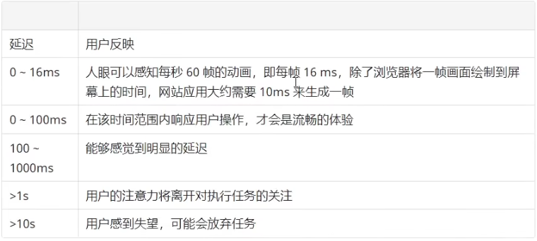

## RAIL 性能模型
RAIL 是 Response, Animation, Idle, 和 load 的首字符缩写，是一种由 Google Chrome 团队于 2015年提出的性能模型，用于提升浏览器内的用户体验和性能。

RAIL 模型的理念是 “以用户为中心，最终目标不是让您的网站在任何特定设备上都能运行很快，而是使用户满意”。

这个名字的由来是四个应为单次的首字母：
  - 响应（Response）: 应该尽可能快速的响应用户，应该在100ms 以内响应用户输入。
  - 动画（Animation）: 在展示动画的时候，每一帧应该以 16ms 进行渲染，这样可以保持动画效果的一致性，并且避免卡顿。
  - 空闲（Idle）: 当使用JavaScript 主线程的时候，应该把任务划分到执行时间小于50ms的片段中去，这样可以释放线程以进行用户交互。
  - 加载（Load）: 应该在小于1s的时间内加载完成你的网站，并可以进行用户交互。
  
  根据网络条件和硬件不同，用户对性能延迟的理解也有所不同。例如，通过快速的 Wi - Fi 连接在功能强大的台式机上加载站点通常在1s内完成，用户对此已经习以为常。在 3G 连接速度较慢的移动设备上加载网站需要花费更多时间，因此移动用户通常更耐心，在移动设备上加载5s是一个更现实的目标。

  这四个单词代表与网站或应用的生命周期相关的四个方面，这些方面会以不同的方式影响整个网站的性能。

  我们将用户作为之后性能优化的中心，首先需要了解用户对于延迟的反应。用户感知延迟的时间窗口，如下表所示。

  

  ### 响应

  指标：应该尽可能快速的响应用户，应该在 100ms 以内想用用户输入。