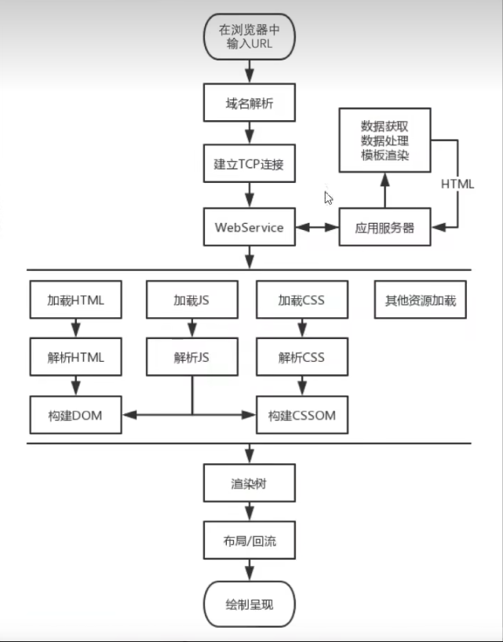

# 前端性能优化介绍
你是否经经历过以下场景：
- 面试中
- 了解性能优化吗？
- 输入URL到看到整个页面经历了什么过程？
- ...
- 工作中
- 页面加载好慢，不知道是前端问题还是后端问题
- 页面交互卡顿，不知道具体哪里出了问题
- ...
- 如何从一个初级程序员升为中级、高级审计更高能力水平的程序员？

## 什么是Web性能
简单来说就是你的网站够不够快。
- 打开速度
- 动画效果
- 表单提交
- 列表滚动
- 页面切换
- ...

[MDN上的web性能定义](https://developer.mozilla.org/zh-CN/docs/Web/Guide/Performance)：**Web性能是网站或应用程序的客观度量和可感知的用户体验**

-  **减少整体的加载时间：** 减少文件体积、减少HTTP请求、使用预加载
-  **使网站尽快可用：** 仅加载首屏内容，其他内容根据需要进行懒加载
-  **平滑和交互性：** 使用css替代js动画，减少UI重绘
-  **感知表现：** 你的页面可能不能做的更快，但你可以让用户感觉更快，耗时操作要给用户反馈，比如加载动画、进度条、骨架屏等提示信息
-  **性能测定**  性能指标、性能测试、性能监控持续优化

## 为什么要管理Web性能

- 用户的留存
- 网站转化率
- 体验与传播
- 搜索排名
- 客户投诉 
- 提升工作效率
- ...

## 如何进行性能优化
1. 首先需要了解性能指标，多快才算快
1. 使用专业的工具课量化的评估出网站或应用的性能表现
1. 然后立足于网站页面响应的生命周期，分析出找出造成较差性能表现的原因
1. 最后进行技术改造、可行性分析等具体的优化实施
1. 迭代优化

### 性能指标
  - RAIL 性能模型
  - 基于用户体验的核心指标
  - 新一代性能指标：Web Vitals

### 性能测量
如果把对网站的性能优化作为一场旅程，它无疑是漫长且可能还略带泥泞的，那么在开始之前，我们有必要对网站进行性能测量，以知道优化的方向在何处。通常我们会借助一些工具来完成测量，本节先简要介绍以下两个操作，后面会有独立章节介绍他们的使用方式与生成报告的分析。
  - 浏览器 DevTools 调试工具
  - 网络监控分析
  - 性能监控分析
  - ...
  - 灯塔（Lighthouse）
  - 网站整体质量评估，并给出优化简历
  - WebPageTest
  - 多测试地点
  - 全面的性能报告
  - ...
### 生命周期
网站页面的生命周期，通俗地讲就是从我们在浏览器的地址栏输入一个URL后，到整个页面渲染出来的过程。整个过程包括域名解析，建立TCP连接，前后端通过HTTP进行会话，压缩与解压缩，以及前端的关键渲染路径等，把这些阶段拆解开来看，不仅能同意地获得优化性能的启发，而且也能为今后的前端工程师之路构建出完整的知识框架，网站页面加载的生命周期如下所示。

### 优化方案 
经过对网站页面性能的测量及渲染过程的了解，相信你对于糟糕性能体验的原因已经比较清楚了，那么接下来便是优化性能，这也是本课程所要呈现给读者的大部分篇幅。本节先简单扼要的介绍一些优化方面的思路。
  - 从发出请求大屏收到响应的优化，比如DNS查询、HTTP长链接、HTTP2、HTTP压缩、HTTP缓存。
  - 关键渲染路径优化，比如是否存在不必要的重绘和回流。
  - 加载过程的优化，比如延迟加载，是否有不需要再首屏展示的非关键信息，占用了页面加载的时间。
  - 资源优化，比如图片，视频等不同的格式类型会有不同的使用场景，在使用的过程中是否恰当。
  - 构建优化，比如压缩合并、基于webpack构建优化方案等。
  - ...