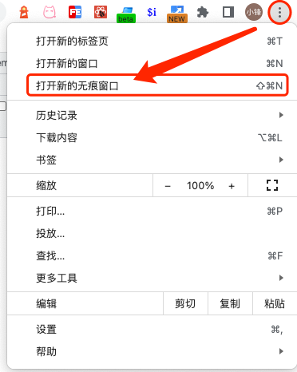
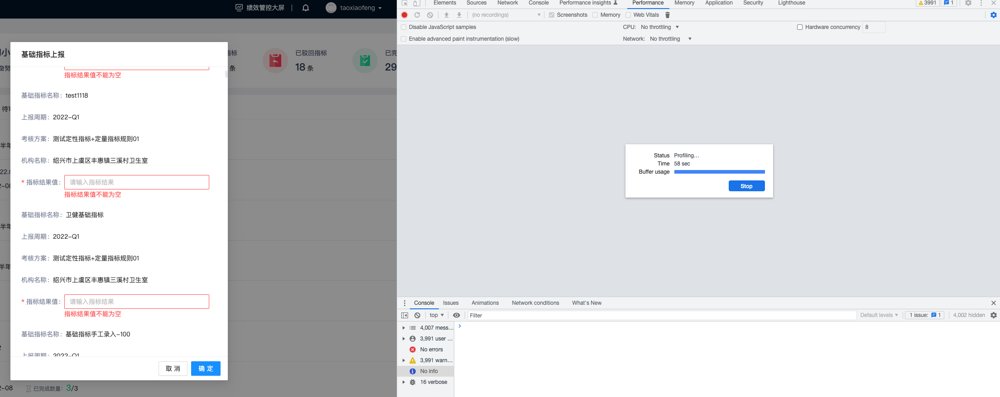
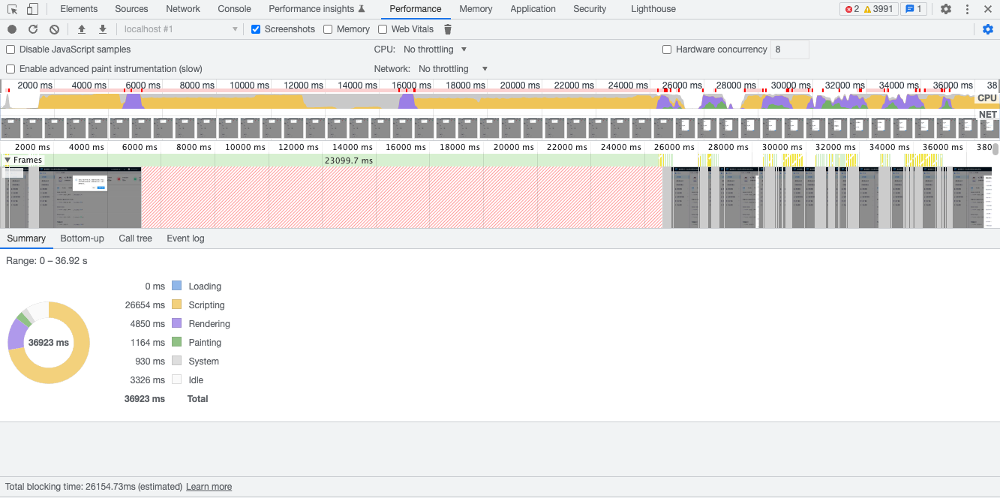
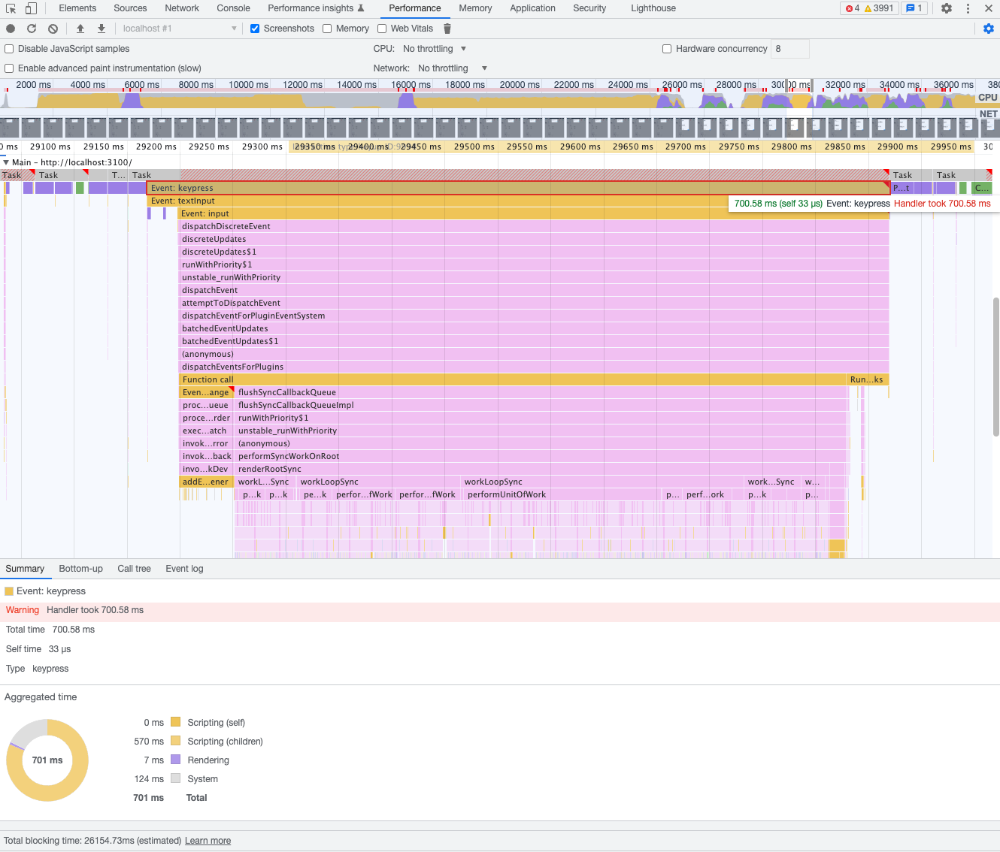

# 基层医疗卫生机构绩效考核系统-性能优化

基于性能测量工具(Chrome DevTools Performance)分析页面在浏览器运行时的性能表现。

1. ## 基本配置

  - 启用Chrome浏览器的无痕模式访问基层绩效系统

    

    以无痕模式打开Chrome浏览器。无痕模式确保Chrome在干净的状态下运行。例如，如果Chrome安装了很多扩展插件，这些扩展插件可能会影响到性能测量的结果。

  - 在Chrome浏览器的DevTools中，选择 Performance tab
    Performance 采用Chrome浏览器默认设置

2. ## 记录运行时性能

  - 在 DevTools 中，单击Record记录。DevTools 在页面运行时捕获性能指标。

    - 以未进行优化过的基础指标上报列表为示例：

      
    - 等待几秒钟，点击Stop，DevTools 停止记录，处理数据，然后在性能面板上显示结果。

      
    - 在性能报告中，有很多的数据。可以通过双击，拖动等等动作来放大缩小报告范围，从各种时间段来观察分析报告。从分析结果数据中选取基础指标填报操作时的分析数据。

      

    

